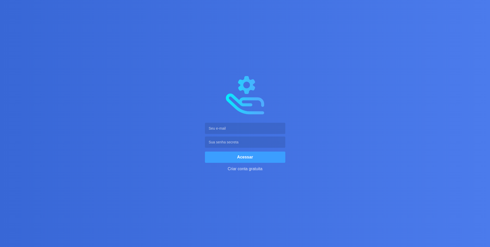
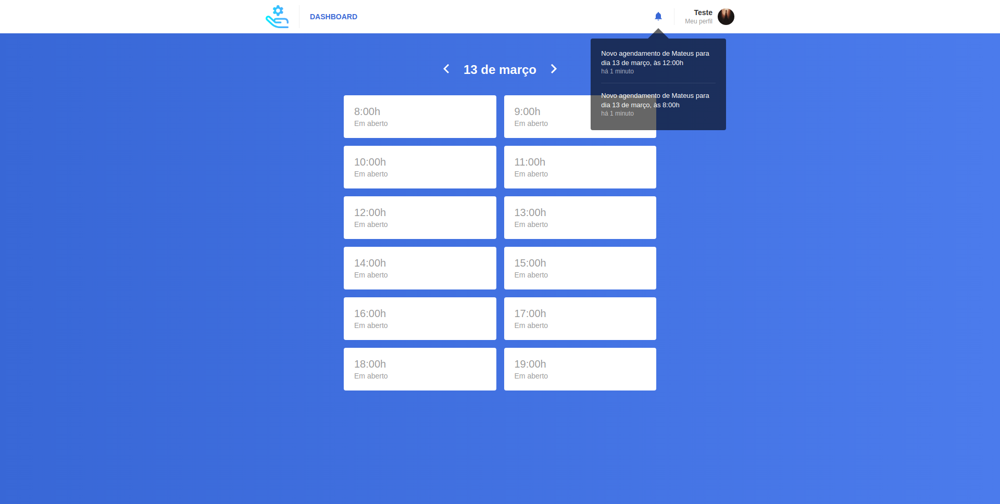
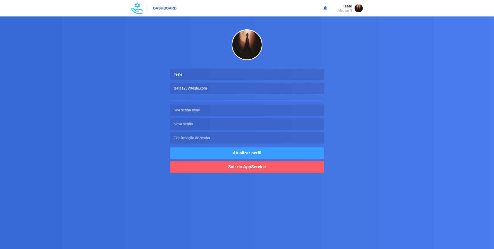

# app-service-provider-app

## What he does?

This is the web part of the application to manage the registration of service providers. The server part can be found [here](https://github.com/mateusgiroletti/app-service-provider-server.git). And the mobile part can be found [here](https://github.com/mateusgiroletti/app_service_provider_mobile).

## What is your use?

Intended to apply the knowledge obtained in courses and tutorials on the internet using ReactJs technologies and its environment, such as components, states, state managers, styling and API consumption.

## Screenshots

Here you can have a preview of the screens.

## Sign In

Login screen.



## Sign Up

Registration screen.


## Dashboard

Here the provider that is logged in can see their appointments, appointment notifications and can navigate to their profile.



## Profile

This is the profile screen, where the provider can change avatar, name, email or password and exit the App.




## How to use?

Clone this project on your favorite dir:

```console
git clone https://github.com/mateusgiroletti/app-service-provider-web.git
```

Change to the root directory and install the necessary packages:

```console
cd app-service-provider-web/ && npm install
```

Runs the app in the development mode.

```console
npm run start
```

Open <a href="http://localhost:3000/" target="_blank">Here</a> to view it in your browser.

## Contact

If you find any errors, feel free to open an issue. If you want to talk to me personally by [Email](mailto:mateusgiroletti97@gmail.com) or [LinkedIn](https://www.linkedin.com/in/mateus-vinicios-sorgatto-giroletti-7a0647182/)